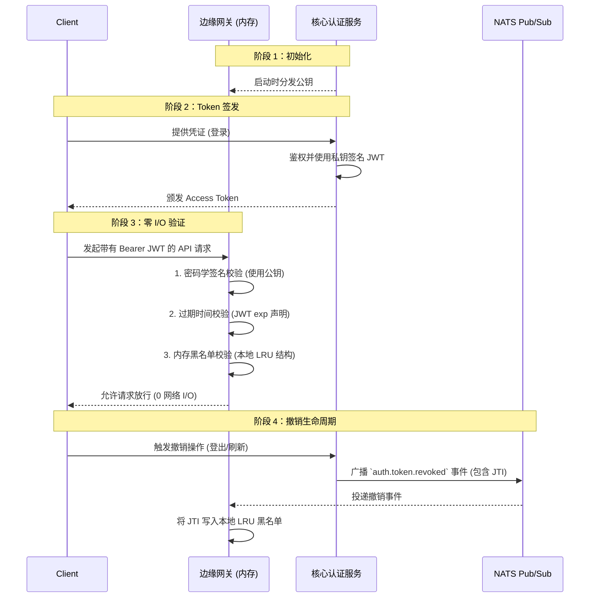

<head>
  <meta name="twitter:card" content="summary_large_image" />
  <meta property="og:title" content="理解超大规模下的零 I/O 鉴权架构 | Ocean Chat" />
  <meta property="og:description" content="深入解析 Ocean Chat 如何通过非对称加密和事件驱动的内存黑名单，在千万级并发连接下实现零网络 I/O 的鉴权机制。" />
  <link rel="canonical" href="https://docs.oceanchat.com/zh-CN/devdocs/understanding-zero-io-authentication" />
</head>

# 理解超大规模下的零 I/O 鉴权架构

鉴权机制是任何即时通讯（IM）平台的正门。然而，当像 Ocean Chat 这样的平台规模扩展到需要处理 **千万级并发连接** 时，传统的鉴权范式就会从安全卫士蜕变为阻碍系统性能的致命瓶颈。

本文档解释了 Ocean Chat **零 I/O 鉴权架构** 的概念基础，详细阐述了为什么传统方法在超大规模下会失效，以及非对称密码学与事件驱动内存结构的结合是如何彻底解决这些局限性的。

---

## 背景：传统鉴权机制的性能瓶颈

在标准的微服务架构中，API 网关通常使用共享的对称密钥（如 HS256）来验证 JSON Web Token (JWT) 的签名，随后查询一个中心化的远程缓存（例如 Redis 白名单）来确认该 Token 的有效状态。

虽然这种做法保证了严格的数据一致性，但在面对海量并发时，它暴露出严重的结构性缺陷：

1. **远程 I/O 惩罚：** 每一次传入的 HTTP 请求、WebSocket 握手或心跳 Ping，都必须进行一次跨越网络的 Redis 查询。
2. **Redis 读风暴：** 在 1000 万并发用户的体量下，常规的业务流量会轻易产生每秒数百万次（RPS）的请求。这种高度集中的读取流量会形成“热点（Hotkey）”效应，足以压垮最顶级的 Redis 集群，导致延迟飙升、连接超时，并最终引发整个基础设施的级联雪崩。
3. **安全边界脆弱：** 核心的认证服务（签发者）与边缘的 API 网关（验证者）共享同一个对称密钥，这意味着如果任何一个边缘网关节点被攻破，攻击者就能直接伪造最高权限的系统 Token。

为了实现仅受限于 CPU 算力的无限水平扩展，Ocean Chat 必须将远程网络 I/O 从 Token 验证的关键路径中彻底剔除。

---

## 核心概念 1：非对称密码学 (RS256)

零 I/O 架构的第一大支柱，是从对称（共享密钥）加密向 **非对称（公私钥对）加密** 的转变，具体而言是采用 RS256 算法。

这种转变在系统内部严格划分了职责边界：
- **签发者（Auth 服务）：** 只有位于内网深处、受到高度安全保护的认证服务才持有 **私钥 (Private Key)**。它是系统中唯一有能力生成并签名合法 JWT 的实体。
- **验证者（API 与 WS 网关）：** 部署在边缘的网关仅持有 **公钥 (Public Key)**。它们可以通过数学运算来验证某个 Token 确实是由 Auth 服务签发的且未被篡改，但它们绝对无法凭空创造新的 Token。

:::tip 安全态势的提升
通过引入非对称加密，即使边缘节点被攻破，其“爆炸半径”也被降到了最低。获取了 API 网关控制权的攻击者只能拿到公钥，而公钥在数学上根本无法用于伪造新的鉴权凭证。
:::

---

## 核心概念 2：事件驱动的内存黑名单

解决了密码学问题只能证明一个 Token 是“被合法签发”的，但无法证明它“当前仍然有效”（例如，用户可能已经登出了系统）。

传统系统通过同步查询中心化白名单来解决这个问题。Ocean Chat 颠覆了这一范式：网关会预先假设所有密码学合法的 Token 都是有效的，**除非它收到了明确的撤销通知**。这是通过 **事件驱动的内存黑名单** 来实现的。

网关不再同步地向中心数据库发问“这个 Token 有效吗？”，而是依赖一个异步的事件流，在 Token 失效时被动接收通知。

---

## 深度工作流解析

该架构的协同运作贯穿了用户生命周期的四个不同阶段。

### 阶段 1：密钥分发与初始化
当 API 网关或 WebSocket 网关实例启动时，它会从安全的集中式配置中心（或直接从 Auth 服务）获取公钥。这个公钥会被安全地缓存在网关进程的本地内存中。此时，网关已经具备了在本地独立进行验签的能力。

### 阶段 2：Token 签发
当用户在 Auth 服务成功通过身份验证（例如通过密码或 OAuth）时，服务会构建一个 JWT 载荷。最关键的是，这个载荷必须包含一个唯一的 JWT ID（`jti` 声明）和一个过期时间戳（`exp` 声明）。Auth 服务使用其严密保管的私钥对该载荷进行签名，并将生成的 Token 返回给客户端。

### 阶段 3：零 I/O 验证路径
这是每秒发生数百万次的关键路径。当客户端向网关发起请求时：

1. **密码学验证：** 网关使用本地缓存的公钥来验证签名。如果发现任何篡改痕迹，请求会被立即拒绝。
2. **过期验证：** 网关将 `exp` 声明与系统当前时间进行比对。如果已经过期，请求同样被拒绝。
3. **黑名单验证：** 网关从载荷中提取出 `jti` (JWT ID)，并在其本地的内存数据结构（如 LRU 缓存或布隆过滤器）中进行 `O(1)` 时间复杂度的极速查找。

如果该 `jti` 不在本地内存中，请求就被最终确认为合法，并被安全地路由到后端的业务逻辑服务。**在整个验证过程中，网关绝对不会发起任何跨网络的通信去验证 Token。**

### 阶段 4：撤销生命周期
当用户主动登出、强制全端下线、刷新会话或账号被封禁时，Token 必须被立即撤销。

1. **触发：** 客户端的请求或内部的后台管理动作在 Auth 服务触发了撤销流程。
2. **广播：** Auth 服务向 NATS JetStream Pub/Sub 主题发布一条高优先级的 `auth.token.revoked` 事件。事件载荷中包含被撤销 Token 的 `jti` 及其剩余存活时间。
3. **摄入：** 作为该主题订阅者的所有活跃网关实例，会异步接收到这条事件。
4. **本地更新：** 每个网关都会迅速将该 `jti` 插入到自己的本地内存黑名单中。
5. **自动驱逐：** 为了防止本地内存无限膨胀，内存缓存被配置为会在该 Token 原定的 `exp` 过期时间戳到达时，自动将该 `jti` 驱逐出内存。因为一旦 Token 自然过期，它在第 2 步的过期验证中就会必然失败，因此完全没有必要继续在黑名单中占据宝贵的内存空间。

---

## 宏观视角与工程权衡

向零 I/O 架构的转型，是一项经过深思熟虑的工程权衡：它牺牲了极其微小的时间窗口内的绝对一致性，换取了极致的系统可扩展性和超低延迟。

:::info 最终一致性 (Eventual Consistency)
由于撤销机制依赖于异步的事件总线 (NATS)，从 Auth 服务撤销 Token 到事件传播至所有边缘网关之间，存在一个微秒到毫秒级的物理时间差。在这个极其微小的时间窗口内，一个已被撤销的 Token 理论上仍可能被网关放行。但在海量并发的 IM 平台架构中，为了彻底消灭网络 I/O 瓶颈，这种“最终一致性”被业界公认为是非常划算且必不可少的权衡。
:::

通过将验证逻辑彻底内化，API 网关层获得了无限水平扩展的能力。网关的整体吞吐量不再被 Redis 集群的最大 IOPS 所钳制，唯一的限制仅仅是执行密码学数学运算的网关实例的 CPU 算力总和。